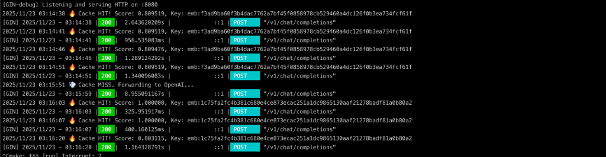

# 🚀 PromptCache

### **Reduce your LLM costs. Accelerate your application.**

**A smart semantic cache for high-scale GenAI workloads.**




---

## 💰 The Problem

In production, **a large percentage of LLM requests are repetitive**:

* **RAG applications**: Variations of the same employee questions
* **AI Agents**: Repeated reasoning steps or tool calls
* **Support Bots**: Thousands of similar customer queries

Every redundant request means **extra token cost** and **extra latency**.

Why pay your LLM provider multiple times for the *same answer*?

---

## 💡 The Solution: PromptCache

PromptCache is a lightweight middleware that sits between your application and your LLM provider.
It uses **semantic understanding** to detect when a new prompt has *the same intent* as a previous one — and returns the cached result instantly.

---

## 📊 Key Benefits

| Metric                      | Without Cache | With PromptCache | Benefit      |
| --------------------------- | ------------- | ---------------- | ------------ |
| **Cost per 1,000 Requests** | ≈ $30         | **≈ $6**         | Lower cost   |
| **Average Latency**         | ~1.5s         | **<10ms**        | Faster UX    |
| **Throughput**              | API-limited   | **Unlimited**    | Better scale |

Numbers vary per model, but the pattern holds across real workloads:
**semantic caching dramatically reduces cost and latency**.

---

## 🧠 Smart Semantic Matching (Safer by Design)

Naive semantic caches can be risky — they may return incorrect answers when prompts look similar but differ in intent.

PromptCache uses a **two-stage verification strategy** to ensure accuracy:

1. **High similarity → direct cache hit**
2. **Low similarity → skip cache directly**
3. **Gray zone → intent check using a small, cheap verification model**

This ensures cached responses are **semantically correct**, not just “close enough”.

---

## 🚀 Quick Start

PromptCache works as a **drop-in replacement** for the OpenAI API.

### 1. Run the server

```bash
git clone https://github.com/messkan/prompt-cache.git
cd prompt-cache
make run
```

### 2. Update your client

Simply change the `base_url` in your SDK:

```python
from openai import OpenAI

client = OpenAI(
    base_url="http://localhost:8080/v1",  # Point to PromptCache
    api_key="sk-..."
)

# First request → goes to the LLM provider
client.chat.completions.create(
    model="gpt-4",
    messages=[{"role": "user", "content": "Explain quantum physics"}]
)

# Semantically similar request → served from PromptCache
client.chat.completions.create(
    model="gpt-4",
    messages=[{"role": "user", "content": "How does quantum physics work?"}]
)
```

No code changes. Just point your client to PromptCache.

---

## 🏗 Architecture Overview

Built for speed, safety, and reliability:

* **Pure Go implementation** (high concurrency, minimal overhead)
* **BadgerDB** for fast embedded persistent storage
* **In-memory caching** for ultra-fast responses
* **OpenAI-compatible API** for seamless integration

---

## 🛣️ Roadmap

### ✔️ v0.1 (Current)

* In-memory & BadgerDB storage
* Smart semantic verification (dual-threshold + intent check)
* OpenAI API compatibility

### 🚧 v0.2

* Redis backend for distributed caching
* Web dashboard (hit rate, latency, cost metrics)
* Built-in support for Claude & Mistral APIs

### 🚀 v1.0

* Clustered mode (Raft or gossip-based replication)
* Custom embedding backends (Ollama, local models)
* Rate-limiting & request shaping

---

## 📄 License

MIT License.
